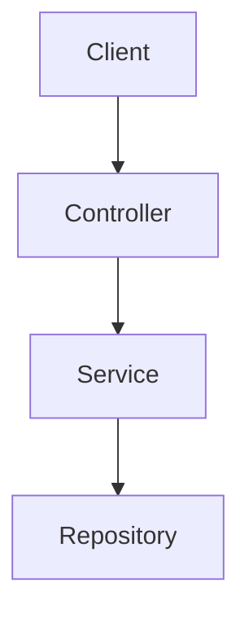

# obsidian-god

> The ultimate Obsidian vault architect skill. One skill to rule them all.

Read references/ files ON DEMAND — do not preload all of them. Load only what the active command needs.

## Commands

| Command | Triggers | What it does |
|---------|----------|--------------|
| `/godmode` | full audit requested | Phase audit → plan → execute with confirmation |
| `/godmode --domain X` | scoped audit | Audit only one domain folder |
| `/adapt` | new/changed files | Normalize frontmatter, inject MOC links, fix links |
| `/adapt --dry-run` | preview only | Show planned changes, write nothing |
| `/rollback` | undo vault changes | Restore from `.obsidian-god/snapshots/` |
| `/mocsync` | MOC out of date | Regenerate all MOC files from vault state |
| `/format` | apply OFM formatting | Add callouts, wikilinks, tags, proper frontmatter |

---

## VAULT OWNERSHIP DOCTRINE

> The vault belongs to the user. Structure they built over time is intentional.

**DO NOT** restructure, rename, or reorganize unless user explicitly says `/godmode --restructure` or asks directly.

**Default behavior for existing vaults:**
- New note created by user → run `/adapt` to normalize + append to hub
- Existing notes → only add missing frontmatter fields, MOC link, Related section
- New concept fits in existing folder → append link to hub note of that folder
- Vault structure looks "wrong" → **suggest** improvement, never auto-apply

**APPEND, not OVERWRITE. SUGGEST, not RESTRUCTURE.**

---

## CRITICAL SAFETY RULES — READ FIRST

**BEFORE any file write, rename, merge, or delete:**

1. **ALWAYS snapshot first** — run `scripts/snapshot.js` or create manual backup
2. **NEVER delete** without explicit user confirmation + `--confirm-delete` flag
3. **MERGE not DELETE** — when consolidating duplicates, merge content then archive
4. **DRY-RUN default** — all destructive operations show plan first, execute only on approval
5. **ROLLBACK always available** — every operation writes a rollback manifest

> [!warning] DELETION IS FORBIDDEN WITHOUT EXPLICIT USER CONSENT
> If you find orphans, duplicates, or empty notes — PROPOSE action, never auto-delete.
> The user's vault is their second brain. Data loss is unacceptable.

---

## /godmode — Full Vault Audit

### Phase 1: Inventory
- List all `.md`, `.canvas`, `.base` files
- Map folder structure vs expected architecture
- Count notes per domain, orphan rate, link density

### Phase 2: Analyze
Check for:
- **Orphan notes** — zero inbound + outbound links
- **Giant notes** — >500 lines (split candidates)
- **Missing hub notes** — folder exists, no `FolderName.md`
- **Missing MOCs** — `Meta/MOCs/MOC - Domain.md` absent
- **Duplicate concepts** — same topic in multiple files
- **Missing frontmatter** — no `tags`, `aliases`, or `created`
- **Broken wikilinks** — `[[Target]]` with no matching file
- **Weak links** — notes with <2 connections
- **Poor naming** — generic names like `Note`, `Untitled`, `New note`
- **Misplaced resources** — articles/links in Knowledge instead of Resources
- **Deep nesting** — >3 levels of subfolders

### Phase 3: Plan
Output structured change list:
```
CREATE  Meta/MOCs/MOC - Backend.md
RENAME  Backend/springnotes.md → Backend/Spring Boot/Spring Boot.md
MERGE   Backend/DI.md + Backend/injection.md → Backend/Spring Boot/Dependency Injection.md
ADD LINKS  Java/Java.md → [[Collections]] [[Streams]] [[JVM]]
FORMAT  Frontend/React/React.md → add frontmatter, callouts, mermaid
ARCHIVE Backend/old-spring-tutorial.md → 03 Archive/
PROPOSE DELETE  00 Inbox/empty-note.md  [AWAITING CONFIRMATION]
```

### Phase 4: Execute
- Show full plan to user
- Require explicit approval before any writes
- Snapshot BEFORE first write (see `/rollback`)
- Apply changes in order: CREATE → RENAME → MERGE → ADD LINKS → FORMAT → ARCHIVE
- Never auto-delete — only archive or propose

### Phase 5: Report
```
Health Score: 78/100 (+14 from last audit)
Orphans fixed: 12
MOCs created: 3
Links added: 47
Notes merged: 4
Notes archived: 2
Rollback available: .obsidian-god/snapshots/2026-06-05T14:30:00/
```

### Health Score (0–100)
| Score | Status |
|-------|--------|
| 90–100 | 🔵 Knowledge graph mastery |
| 75–89 | 🟢 Healthy vault |
| 50–74 | 🟡 Decent, needs /adapt regularly |
| < 50 | 🔴 Needs full /godmode |

---

## /adapt — Continuous Normalization

For recently changed files (default: last 24h):

1. Detect modified `.md` files
2. Add missing frontmatter (`tags`, `aliases`, `created`, `status`)
3. Inject `Part of [[MOC - Domain]]` link if missing
4. Add `## Related` callout section
5. Fix malformed wikilinks (spaces, wrong capitalization)
6. Update `.last-adapt` marker in `Meta/System/`
7. Report what changed

---

## /rollback — Full Undo System

**⚠️ STRICT: Every destructive operation must create a snapshot first.**

### Snapshot Structure
```
.obsidian-god/
└── snapshots/
    └── 2026-06-05T14:30:00/
        ├── manifest.json       ← what changed, in what order
        ├── files/              ← full copies of modified files
        │   ├── Backend/Spring Boot/Spring Boot.md
        │   └── Meta/MOCs/MOC - Backend.md
        └── deleted/            ← files moved to archive (never hard-deleted)
```

### manifest.json schema
```json
{
  "timestamp": "2026-06-05T14:30:00Z",
  "command": "/godmode",
  "operations": [
    { "op": "CREATE", "path": "Meta/MOCs/MOC - Backend.md" },
    { "op": "RENAME", "from": "Backend/old.md", "to": "Backend/New.md" },
    { "op": "MERGE", "sources": ["a.md", "b.md"], "target": "c.md" },
    { "op": "ARCHIVE", "from": "X.md", "to": "03 Archive/X.md" }
  ]
}
```

### Rollback procedure
1. Read manifest — reverse operations in reverse order
2. RENAME back: move target → from
3. UNMERGE: restore original source files from `snapshots/files/`
4. UNARCHIVE: move `03 Archive/X.md` → original path
5. DELETE created files (new MOCs, new hub notes)
6. Report what was restored

> [!warning] Rollback is destructive in the other direction.
> Always confirm with user before executing rollback.

---

## /mocsync — MOC Regeneration

MOCs live in `Meta/MOCs/`. One MOC per root domain.

**Required MOCs:**
- `MOC - Backend.md`
- `MOC - Frontend.md`
- `MOC - Programming.md`
- `MOC - DSA.md`
- `MOC - Databases.md`
- `MOC - DevOps.md`
- `MOC - System Design.md`
- `MOC - AI.md`
- `MOC - Computer Science.md`

**MOC structure:** Link to major topic hub notes ONLY — not individual concepts.

```markdown
---
tags: [moc, backend]
created: 2026-06-05
---

# MOC - Backend

## Topics
- [[Spring Boot]] — Java web framework
- [[REST API]] — API design patterns
- [[JPA & Hibernate]] — ORM and persistence
- [[Security]] — Auth, JWT, OAuth

## Cross-Domain
- [[Docker]] (DevOps)
- [[PostgreSQL]] (Databases)
```

**MOC rules:**
- MOC links → topic hub notes only (never to leaf concept notes)
- Max ~20 links per MOC — if more, create sub-MOCs
- Every hub note must have `Part of [[MOC - Domain]]` link
- Graph shape: `MOC → Hub Note → Concept Note`

---

## /format — Obsidian Formatting Pass

Apply full Obsidian Flavored Markdown formatting to a file or folder.

Read `references/OFM_FORMATTING.md` for complete formatting reference.

Quick rules:
- Add YAML frontmatter if missing
- Convert bare links to `[[wikilinks]]`
- Add `[!info] Related Concepts` callout
- Add Mermaid diagram for architecture/flow notes
- Use language-tagged code blocks
- Add `#tags` in frontmatter, not inline (unless linking)
- Use `==highlight==` for key terms on first use
- Use `> [!tip]` for pro tips, `> [!warning]` for gotchas

---

## Vault Architecture

```
📁 00 Inbox          ← Unprocessed captures
📁 01 Knowledge
│   ├── Backend/
│   ├── Frontend/
│   ├── Programming/
│   ├── DSA/
│   ├── Databases/
│   ├── DevOps/
│   ├── System Design/
│   ├── AI/
│   └── Computer Science/
📁 02 Resources      ← Articles, bookmarks, references
📁 03 Archive        ← Retired notes (never delete)
📁 Meta/
    ├── Attachments/
    ├── MOCs/        ← Global MOC notes (one per domain)
    ├── Templates/
    └── System/      ← .last-adapt, health logs
```

### Topic Folder Pattern
Each domain has topic subfolders. Each topic subfolder has a hub note.

```
Backend/
├── Spring Boot/
│   ├── Spring Boot.md         ← Hub note (acts as local MOC)
│   ├── Dependency Injection.md
│   ├── Bean Lifecycle.md
│   └── Configuration.md
├── REST API/
│   ├── REST API.md
│   └── HTTP Methods.md
```

### Hub Note Pattern (mandatory)
Every topic folder needs `TopicName.md` as hub:

```markdown
---
tags: [spring-boot, backend, java]
aliases: [Spring, Spring Framework]
created: 2026-06-05
status: active
---

# Spring Boot

Part of [[MOC - Backend]]

> Brief description of topic.

## Core Concepts
- [[Dependency Injection]]
- [[Bean Lifecycle]]
- [[Component Scan]]

## Build & Config
- [[Maven]]
- [[Configuration]]

## Related

> [!info] Related Concepts
> - [[JPA & Hibernate]]
> - [[REST API]]
> - [[Java]]


```

---

## Note Separation Rules

Create a dedicated note when ANY of:
1. Topic > ~300–500 words
2. Contains substantial code examples
3. Will be revised independently
4. Multiple notes link to it
5. Represents a major concept

Keep inside parent note when:
- Small definition or terminology
- Short explanation < 100 words
- Setup step (unless reused)
- One-time reference

---

## Graph Quality Rules

Target graph shape:
```
MOC (1 per domain)
 ↓ links to
Hub Notes (1 per topic folder)
 ↓ links to
Concept Notes (major subtopics)
 ↓ links to
Related Concepts (cross-domain bridges)
```

Every note should have:
- ≥1 inbound link (from hub or MOC)
- ≥1 outbound link (to concept or related hub)

Cross-domain links (good signal):
- `[[Docker]]` mentioned in `Spring Boot.md`
- `[[PostgreSQL Indexing]]` mentioned in `JPA & Hibernate.md`

---

## Reference Files

Load on demand — do not load all at startup:

| File | Load when |
|------|-----------|
| `references/OFM_FORMATTING.md` | `/format` or adding Obsidian syntax |
| `references/GRAPH_PATTERNS.md` | analyzing link quality, graph health |
| `references/VAULT_ANALYSIS.md` | `/godmode` Phase 2 analysis |
| `references/NOTE_TEMPLATES.md` | creating new hub/concept/MOC notes |
| `references/PROPERTIES.md` | frontmatter fields, tag taxonomy |

---

## Scripts

| Script | Purpose |
|--------|---------|
| `scripts/snapshot.js` | Create rollback snapshot |
| `scripts/godmode.js` | Full vault audit |
| `scripts/adapt.js` | Normalize recent files |
| `scripts/mocsync.js` | Regenerate MOC files |
| `scripts/rollback.js` | Restore from snapshot |
