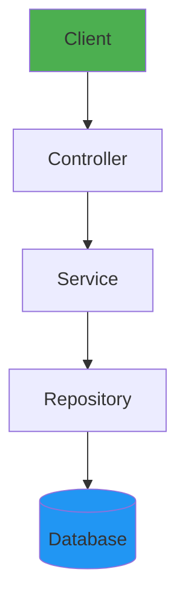
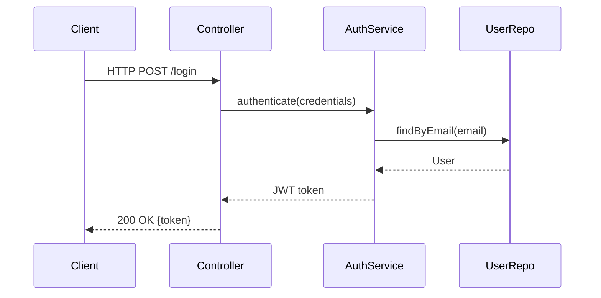
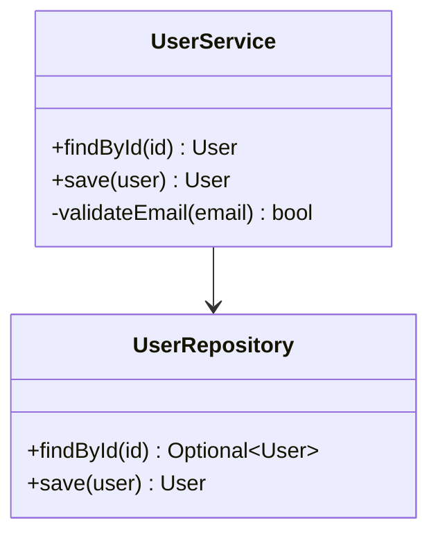
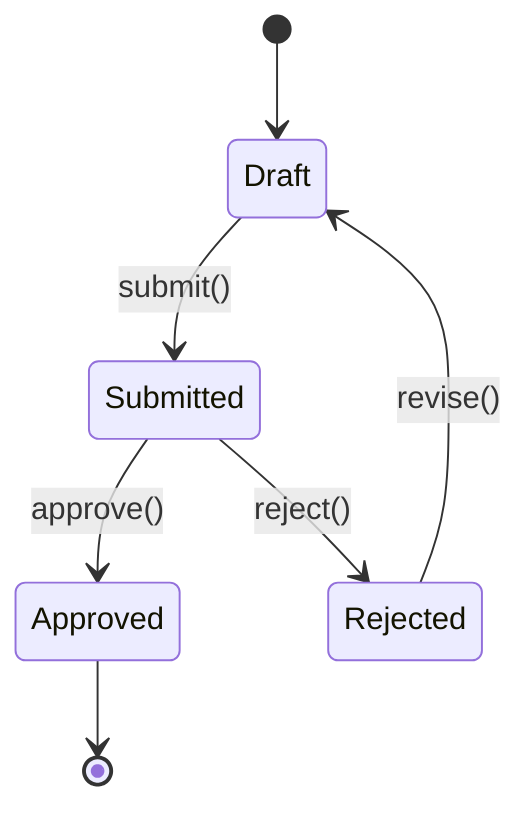
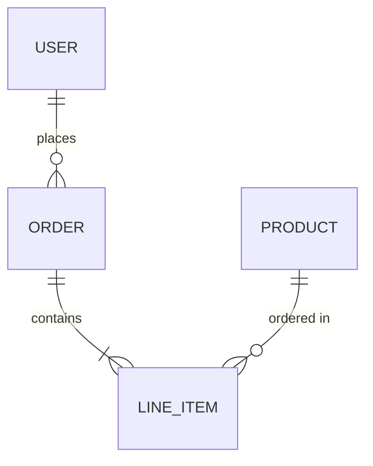

# OFM_FORMATTING.md — Obsidian Flavored Markdown Reference

Complete reference for Obsidian-specific formatting. Standard Markdown (headings, bold, italic, tables, code blocks) is assumed knowledge. This covers Obsidian extensions only.

---

## Frontmatter / Properties

Always at the top of the file. YAML between `---` delimiters.

```yaml
---
title: Spring Boot
tags: [spring-boot, backend, java, framework]
aliases: [Spring, Spring Framework, Spring MVC]
created: 2026-06-05
updated: 2026-06-05
status: active          # active | draft | archived | evergreen
type: hub               # hub | concept | moc | resource | template
domain: Backend
---
```

### Property Types
| Type | Syntax | Use |
|------|--------|-----|
| Text | `title: Spring Boot` | Single string |
| List | `tags: [a, b, c]` | Multiple values |
| Date | `created: 2026-06-05` | ISO date |
| Boolean | `published: true` | true/false |
| Number | `priority: 3` | Integer/float |
| Link | `parent: "[[Spring Boot]]"` | Wikilink in property |

### Required Properties (enforce in /adapt)
```yaml
tags: [...]         # always required
aliases: [...]      # for hub notes — include common variations
created: YYYY-MM-DD
status: active      # active | draft | archived
```

### Tag Taxonomy (developer vault)
```
Structure tags:    #moc  #hub  #concept  #resource  #template
Domain tags:       #backend  #frontend  #devops  #databases  #ai  #cs
Tech tags:         #java  #spring-boot  #react  #docker  #postgresql
Status tags:       #draft  #evergreen  #archived  #review
```

---

## Wikilinks

```markdown
[[Note Name]]                    ← Basic link
[[Note Name|Display Text]]       ← Custom display
[[Note Name#Heading]]            ← Link to heading
[[Note Name#^block-id]]          ← Link to block
[[#Heading in same note]]        ← Same-note heading
```

**Rule:** Use `[[wikilinks]]` for all vault-internal links. Use `[text](url)` only for external URLs. Obsidian tracks renames automatically for wikilinks.

**Block IDs** — append `^block-id` to any paragraph:
```markdown
This concept is critical for understanding the framework. ^di-core-rule
```
Reference it: `[[Spring Boot#^di-core-rule]]`

---

## Embeds

```markdown
![[Note Name]]              ← Embed full note
![[Note Name#Heading]]      ← Embed section
![[Note Name#^block-id]]    ← Embed block
![[image.png]]              ← Embed image
![[image.png|300]]          ← Image with width
![[image.png|300x200]]      ← Image with dimensions
![[document.pdf#page=3]]    ← Embed PDF page
```

---

## Callouts

Use callouts for structured information blocks. Never use plain `>` blockquotes for semantic content.

### All Callout Types
```markdown
> [!note]       ← General note
> [!info]       ← Informational
> [!tip]        ← Pro tip or shortcut
> [!important]  ← Must-know
> [!warning]    ← Gotcha or risk
> [!danger]     ← Critical / breaking
> [!example]    ← Code or usage example
> [!question]   ← Open question / TODO
> [!quote]      ← Attribution
> [!abstract]   ← Summary / TLDR
> [!success]    ← Correct usage / result
> [!failure]    ← Common mistake
> [!todo]       ← Action item
```

### Callout Syntax
```markdown
> [!tip] Custom Title
> Body text here. Supports **bold**, `code`, [[links]].
> Multiple lines supported.
```

### Foldable Callouts
```markdown
> [!info]- Collapsed by default
> Content hidden until expanded.

> [!info]+ Expanded by default
> Content visible, but collapsible.
```

### Developer Vault Callout Patterns

**Related Concepts (use on every hub note):**
```markdown
> [!info] Related Concepts
> - [[Dependency Injection]]
> - [[Bean Lifecycle]]
> - [[Application Context]]
```

**Pro Tip:**
```markdown
> [!tip] Performance Tip
> Use `@Transactional(readOnly = true)` on read-only service methods.
```

**Common Mistake:**
```markdown
> [!failure] Common Mistake
> Don't annotate `@Service` classes with `@Component` — they're already components.
```

**Prerequisites:**
```markdown
> [!important] Prerequisites
> Understand [[Java OOP]] and [[Maven]] before diving into Spring Boot.
```

---

## Tags

### Inline vs Frontmatter
- **Frontmatter tags** (preferred): `tags: [java, backend]`
- **Inline tags** (use sparingly): `#java` in body text creates clickable links

Inline tags make sense when tagging a specific statement:
```markdown
The `#java` memory model differs from C++ in key ways.
```

Avoid inline tags as decoration — they clutter the note body.

---

## Text Formatting (Obsidian extensions)

```markdown
==highlighted text==          ← Yellow highlight (use for key terms)
~~strikethrough~~             ← Deprecated / wrong info
***bold italic***             ← Maximum emphasis (rare)
`inline code`                 ← Code, CLI commands, method names

<!-- HTML comment, hidden in preview -->

$$LaTeX inline: E = mc^2$$    ← Math inline
$$                            ← Math block
\sum_{i=1}^{n} i = \frac{n(n+1)}{2}
$$
```

### Highlighting Guidelines
- Use `==highlight==` for key terms on **first use** only
- Use `**bold**` for important concepts
- Don't over-highlight — it loses meaning

---

## Code Blocks (always language-tagged)

```markdown
```java
@RestController
public class UserController {
    @GetMapping("/users")
    public List<User> getAll() { return userService.findAll(); }
}
```

```bash
mvn clean install -DskipTests
./gradlew bootRun
```

```sql
SELECT u.id, u.name, COUNT(o.id) as orders
FROM users u LEFT JOIN orders o ON u.id = o.user_id
GROUP BY u.id;
```

```yaml
spring:
  datasource:
    url: jdbc:postgresql://localhost:5432/mydb
```

```json
{ "status": "UP", "components": { "db": { "status": "UP" } } }
```
```

---

## Mermaid Diagrams

Use Mermaid whenever a diagram aids understanding. Required for: architecture, flows, lifecycles, DSA, system design.

### Flowchart
```markdown

```

### Sequence Diagram
```markdown

```

### Class Diagram
```markdown

```

### State Machine
```markdown

```

### ER Diagram
```markdown

```

---

## Tables

Use tables for comparisons only. Not for lists.

```markdown
| Annotation | Scope | Purpose |
|------------|-------|---------|
| `@Component` | Generic | Generic Spring-managed bean |
| `@Service` | Business | Service layer bean |
| `@Repository` | Data | DAO/Repository bean |
| `@Controller` | Web | MVC controller |
```

---

## Canvas (`.canvas` files)

JSON Canvas is Obsidian's visual mind-map format. Create `.canvas` files for complex system diagrams.

```json
{
  "nodes": [
    { "id": "1", "type": "text", "text": "Spring Boot", "x": 0, "y": 0, "width": 200, "height": 60 },
    { "id": "2", "type": "file", "file": "Backend/Spring Boot/Spring Boot.md", "x": 250, "y": 0, "width": 200, "height": 60 }
  ],
  "edges": [
    { "id": "e1", "fromNode": "1", "toNode": "2", "label": "documented in" }
  ]
}
```

Use Canvas for: system architecture overviews, technology relationship maps, learning roadmaps.

---

## Obsidian Bases (`.base` files)

Bases are database views over your vault notes. Use for dashboards and filtered views.

```yaml
# Active Backend Notes Dashboard
filters:
  - field: tags
    operator: contains
    value: backend
  - field: status
    operator: equals
    value: active
sort:
  - field: updated
    direction: desc
fields:
  - title
  - tags
  - status
  - updated
```

---

## Comment Syntax

```markdown
%% This is an Obsidian comment — visible in editor, hidden in preview %%

%%
Multi-line comment
for internal notes, TODOs, editor-only content
%%
```

---

## Footnotes

```markdown
Spring Boot uses convention over configuration[^1].

[^1]: Martin Fowler, "Convention over Configuration", 2006.
```

---

## Formatting Checklist (use in /format)

- [ ] YAML frontmatter present with `tags`, `created`, `status`
- [ ] `Part of [[MOC - Domain]]` link present
- [ ] Hub notes have `## Related` callout `[!info]`
- [ ] Code blocks have language tags
- [ ] Architecture notes have Mermaid diagram
- [ ] Key terms use `==highlight==` on first use
- [ ] External links use `[text](url)` not wikilinks
- [ ] Internal links use `[[wikilinks]]` not markdown links
- [ ] No orphan note (has ≥1 inbound link from hub or MOC)
